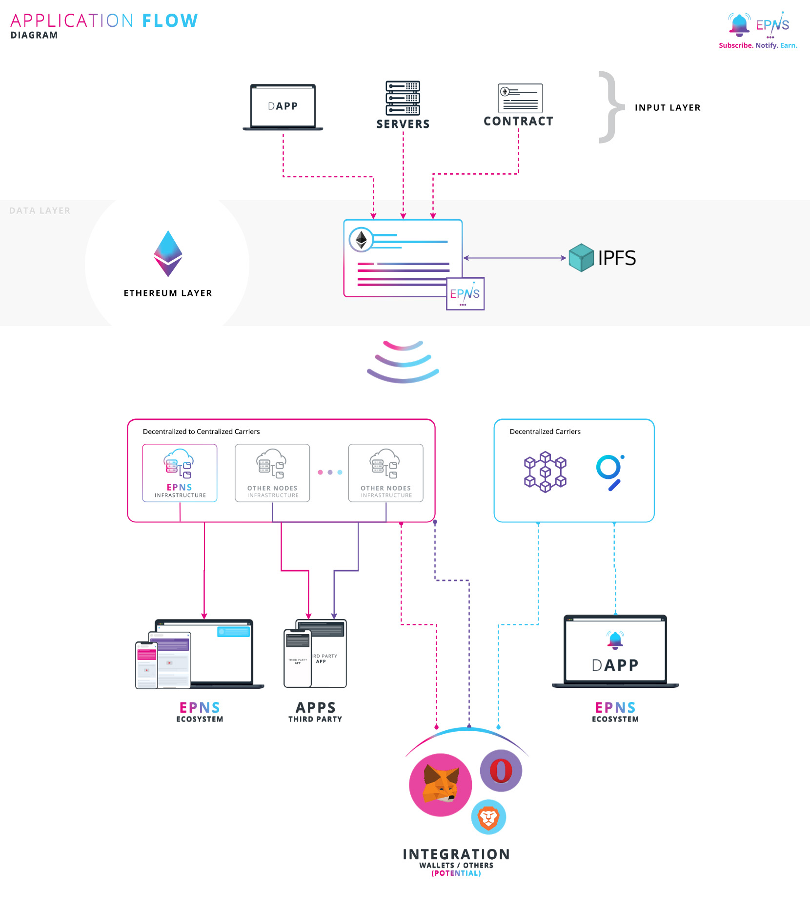

# Sending Notifications

## High Level Application Flow

EPNS uses the following application flow to ensure storage, broadcasting and sending of notifications.


 Abstracting the data layer on chain \(directly or indirectly\) ensures notifications are platform agnostic. 



In the future, we might even support other centralized services apart from Mobile, Tablet, Chrome, Firefox, favorite user wallets, etc. 

As a service, these are automatically enabled for you as and when we integrate them.


