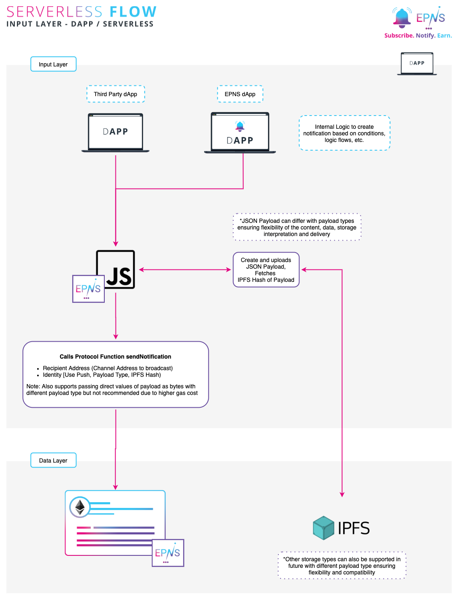

# dApp / Serverless workflow

## Interacting with protocol via dApp / Serverless 

EPNS allows various ways to integrate the protocol into your service. The following flow shows how a dApp can send notification to the protocol.

Sending notification via the dApp to the EPNS protocol requires the following steps:

1. Use your internal logic to figure out what notification you want to send \(ie: alerting users on some smart contract event, some action of theirs, movement in their wallets, a podcast or post from your end, etc\).
2. Form the JSON payload using our JS Library or your which you want to send as notification. Please check [Notification Payload Types](notification-payload-types.md) for supported payload types and their requirements.
3. Interact with protocol using our JS Library or your own.
4. That's it, sit back and relax, we will take it on from here.

