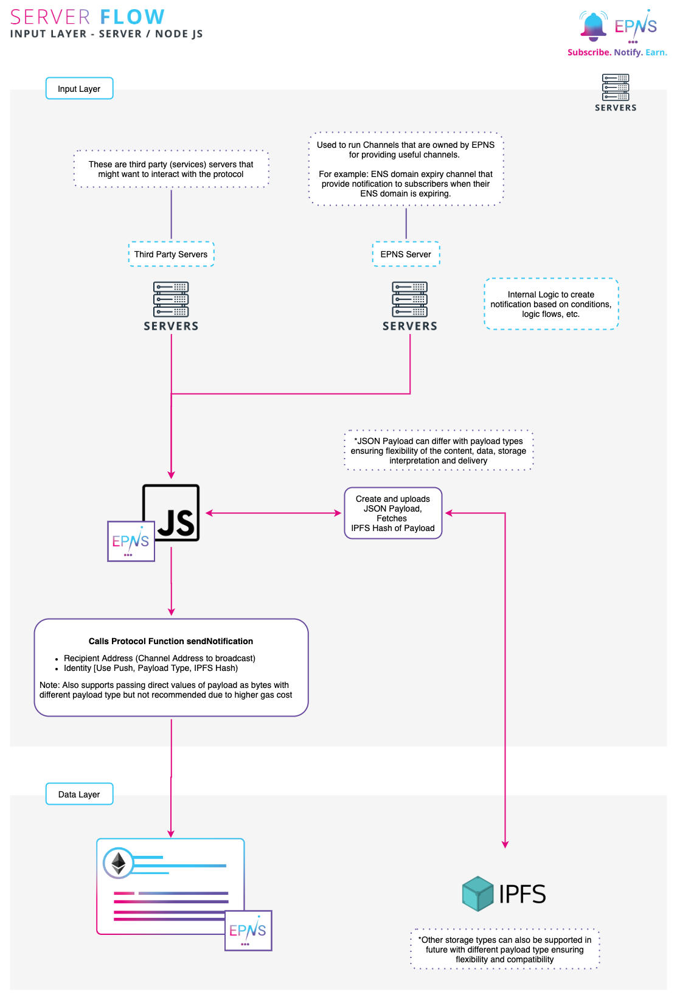

# From Server

## Server integration workflow

EPNS allows various ways to integrate the protocol into your service. The following flow shows how your server can integrate and send notification to the protocol.

### Sending notification via the server

1. Use your internal logic to figure out what notification you want to send \(ie: alerting users on some smart contract event, user actions, movement in their wallets, a podcast or post from your end, etc\).
2. Form the JSON payload using our JS Library or your which you want to send as notification. Please check [Notification Payload Types](notification-payload-types.md) for supported payload types and their requirements.
3. Interact with protocol using our JS Library or your own.
4. That's it, sit back and relax, we will take it on from here.


We run several channels on our NodeJS server implementation like **Btc Price Tracker, ENS Domain Expiry, EthGas Fee Tracker, Wallet Movement Alerter, etc**.

Contact us at [admin@epns.io](mailto://admin@epns.io) incase you want access to that repo for faster implementation / examples.


