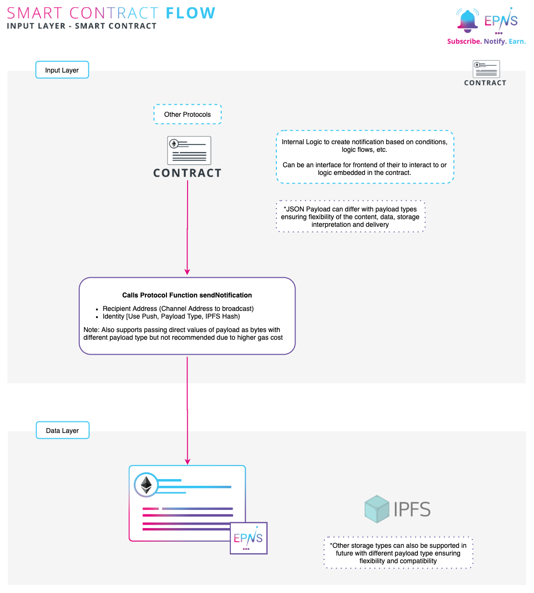

# From Smart Contract

## Smart Contract workflow 

EPNS allows various ways to integrate the protocol into your service. The following flow shows how your  server can integrate and send notification to the protocol.

### Sending notification via the smart contract

1. Use your internal logic to figure out what notification you want to send \(ie: alerting users on some smart contract event, some action of theirs, movement in their wallets, a podcast or post from your end, etc\).
2. This can be done by either having internal logic cooked in your protocol or better yet having a function which you can call from outside which can interact with our protocol.
3. Please check [Notification Payload Types](notification-payload-types.md) for supported payload types and their requirements.
4. Either pass the **hash** of the content you want to send to **EPNS protocol \(recommended\)**. 
5. That's it, sit back and relax, we will take it on from here.


The protocol also supports sending notification 

1. Alternatively, pass the payload in bytes to the protocol with appropriate payload. 


